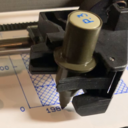

# Pen Plotter

This machine is a print server for HPGL pen plotters.

Processes:
* ipp-server (which is the [ipp-server](https://github.com/hughpyle/ipp-server) Python package), runs the main print-server.
  This also runs a trivial webpage that redirects to the
  main (port 80) webpage.

* apache webserver.
  Home is in `/var/www/html/`.
  Homepage at http://penplot1.local/ (HTML source for the homepage is [here](./www/html/index.html).)

There's also an Avahi service file at
  `/etc/avahi/services/lvp16.service` (source [here](./avahi/services/lvp16.service))
that describes the printer for AirPrint (Bonjour/Zeroconf) discovery.
This means you can find the plotter in your 'Printers' dialog, anywhere
on the local network.  It should even have a nice icon,

The IPP server listens on the standard port 631.
It can do this without being root, using `authbind`, which is enabled by

    sudo touch '/etc/authbind/byport/!631'
    sudo chown pi:pi '/etc/authbind/byport/!631'
    sudo chmod 755 '/etc/authbind/byport/!631'

and then run with a crontab on [./bin/ipp](./bin/ipp), which calls

    authbind --deep python -m ippserver --host penplot1.local --port 631 --ppd "${HOME}/hpgl/data/lvp16.ppd" run "${HOME}/hpgl/bin/print-hpgl"

The `run` argument tells the IPP server that it should print by running the '[print-hpgl](./bin/print-hpgl)' shell-script.
The file to be printed will be passed to the script on stdin, and it then figures out the file type, 
converts the file format into HPGL as needed, and (carefully) sends it to the plotter's serial port. 

